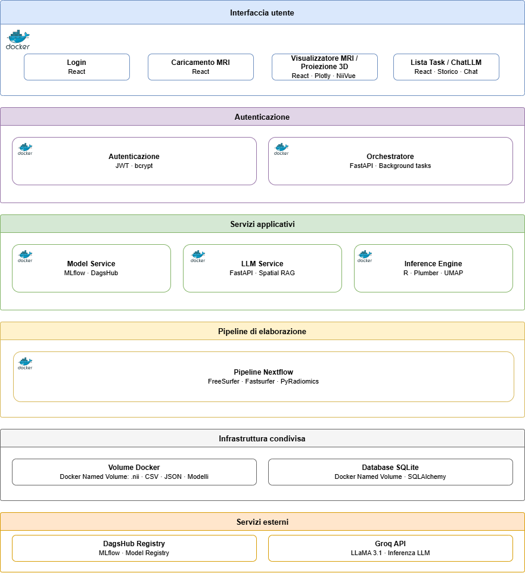

# Clinical Twin

Interfaccia clinica per la diagnosi differenziale di varianti della demenza frontotemporale (FTD) basata su analisi radiomica di risonanze magnetiche cerebrali. Il sistema integra una pipeline di neuroimaging automatizzata (FreeSurfer / FastSurfer + PyRadiomics), un motore di inferenza statistico in R, un assistente AI context-aware e una dashboard React per la visualizzazione multiplanare e l'esplorazione dello spazio latente UMAP.

Progetto di tesi triennale — Università degli Studi di Bari Aldo Moro, a.a. 2024/2025.
Relatore: Prof. Giulio Mallardi.

---

## Architettura



Il sistema è composto da sette microservizi Docker orchestrati tramite Docker Compose:

| Servizio | Tecnologia | Porta |
|---|---|---|
| `api_gateway` | FastAPI, JWT, SQLite | 8000 |
| `orchestrator` | FastAPI, Background Tasks | 8001 |
| `llm_service` | FastAPI, Groq, Spatial RAG | 8002 |
| `model_service` | FastAPI, MLflow, DagsHub | 8003 |
| `inference_engine` | R, Plumber, UMAP | 8004 |
| `nextflow_worker` | FastAPI, Nextflow, DooD | 8005 |
| `frontend` | React, Vite, Plotly, NiiVue | 5173 |

---

## Prerequisiti

- Docker e Docker Compose
- Git
- **GPU NVIDIA** (opzionale): richiesta solo per FastSurfer. FreeSurfer gira su CPU.
- **Licenza FreeSurfer**: file gratuito, ottenibile su [https://surfer.nmr.mgh.harvard.edu/registration.html](https://surfer.nmr.mgh.harvard.edu/registration.html)

> **Windows**: il sistema funziona su Windows con Docker Desktop (Linux containers).
> `HOST_SHARED_VOLUME_DIR` va lasciato vuoto — i volumi Docker vengono risolti automaticamente.
> FastSurfer richiede WSL2 con driver NVIDIA e supporto CUDA; in assenza di GPU è sufficiente usare FreeSurfer.

---

## Installazione

### 1. Clona il repository

```bash
git clone https://github.com/carlosto033/Tesi-FTD.git
cd Tesi-FTD
```

### 2. Configura le variabili d'ambiente

Ogni servizio ha un proprio file `.env`. Copia i template di esempio e compila i valori:

```bash
cp .env.example .env
cp api_gateway/.env.example api_gateway/.env
cp orchestrator/.env.example orchestrator/.env
cp model_service/.env.example model_service/.env
cp llm_service/.env.example llm_service/.env
cp frontend/.env.example frontend/.env
```

Le variabili principali da configurare:

| Variabile | Servizio | Descrizione |
|---|---|---|
| `SECRET_KEY` | `api_gateway`, `orchestrator`, `llm_service` | Chiave JWT — deve essere **identica** in tutti e tre i servizi |
| `GROQ_API_KEY` | `llm_service` | Chiave API Groq ([console.groq.com](https://console.groq.com)) |
| `MLFLOW_TRACKING_URI` | `model_service` | URL del tracking server MLflow su DagsHub (es. `https://dagshub.com/<user>/<repo>.mlflow`) |
| `MLFLOW_TRACKING_USERNAME` | `model_service` | Username DagsHub |
| `DAGSHUB_TOKEN` | `model_service` | Token DagsHub (usato come password per il Model Registry) |
| `REPO_OWNER` | `model_service` | Username proprietario del repo DagsHub |
| `REPO_NAME` | `model_service` | Nome del repo DagsHub |
| `MIG_DEVICE` | root `.env` | UUID della MIG instance GPU (solo su server con GPU partizionata — lasciare vuoto su GPU normali) |
| `HOST_SHARED_VOLUME_DIR` | root `.env` | Path host del volume condiviso (solo su Linux bare metal — lasciare vuoto su Docker Desktop) |

### 3. Aggiungi la licenza FreeSurfer

Copia il file di licenza nella directory del worker:

```bash
cp /path/to/license.txt nextflow_worker/license.txt
```

### 4. Popola la directory `data/`

La cartella `nextflow_worker/data/` non è tracciata nel repository e va popolata manualmente. Contiene i file di configurazione statici necessari alla pipeline:

```
nextflow_worker/data/
└── external/
    ├── ROI_labels.tsv        # Etichette delle 78 ROI cerebrali (FreeSurfer/FSL)
    └── pyradiomics.yaml      # Parametri di configurazione per l'estrazione radiomica
```

Senza questi file il `nextflow_worker` si avvia ma non è in grado di eseguire la pipeline di segmentazione.

### 5. Costruisci le immagini Docker custom

La pipeline Nextflow utilizza il pattern Docker-out-of-Docker (DooD): quando un task viene avviato, Nextflow chiede al daemon Docker dell'host di eseguire i container della pipeline. Le immagini devono quindi essere presenti nel registry locale dell'host — non dentro i container. Il prebuild va eseguito sulla macchina che ospita lo stack, prima di avviare i servizi.

```bash
docker build -t clinical-freesurfer -f nextflow_worker/freesurfer.dockerfile nextflow_worker/
docker build -t clinical-fsl -f nextflow_worker/fsl.dockerfile nextflow_worker/
docker build -t clinical-pyradiomics -f nextflow_worker/pyradiomics.dockerfile nextflow_worker/
```

Questo passaggio va ripetuto solo se i Dockerfile vengono modificati. La build di `clinical-pyradiomics` compila xgboost da sorgente e richiede diversi minuti.

### 6. Avvia lo stack

```bash
docker compose up -d --build
```

Il frontend è accessibile su [http://localhost:5173](http://localhost:5173).

### 7. Crea il primo utente

La registrazione non è esposta nell'interfaccia grafica. Il primo utente va creato tramite Swagger UI: apri [http://localhost:8000/docs](http://localhost:8000/docs), individua l'endpoint `POST /signup` ed eseguilo con username e password desiderati.

---

## Configurazione della pipeline

I parametri di esecuzione della pipeline Nextflow si trovano in `nextflow_worker/nextflow/nextflow.config`. I valori di default sono ottimizzati per il server di deployment; in altri ambienti potrebbe essere necessario adattarli.

| Parametro | Default | Descrizione |
|---|---|---|
| `params.maxforks` | `1` | Numero massimo di processi di segmentazione in parallelo |
| `params.fastsurfer_threads` | `8` | Thread CPU per FastSurfer |
| `params.fastsurfer_device` | `cuda` | Device per FastSurfer (`cuda` o `cpu`) |
| `params.fastsurfer_3T` | `false` | Abilita ottimizzazioni per scanner 3T |
| `params.pyradiomics_jobs` | `4` | Job paralleli per l'estrazione radiomica |
| `params.brain_segmenter` | `freesurfer` | Segmentatore di default (`freesurfer` o `fastsurfer`) |

Su server con GPU partizionata in MIG instances, impostare `MIG_DEVICE` nel file `.env` di root con l'UUID della propria istanza (es. `MIG-51fae91a-...`). Su GPU normali lasciare vuoto.

---

## Struttura del progetto

```
Tesi-FTD/
├── docker-compose.yml
├── .env.example                      # Variabili di deployment (MIG_DEVICE, HOST_SHARED_VOLUME_DIR)
├── .gitignore
├── docs/
│   └── architecture.png              # Diagramma architetturale
│
├── api_gateway/                      # Autenticazione JWT e gestione utenti
│   ├── Dockerfile
│   ├── .env.example
│   ├── main.py
│   ├── requirements.txt
│   ├── core/
│   │   ├── config.py
│   │   └── security.py
│   ├── models/
│   │   └── user.py
│   └── routers/
│       └── auth.py
│
├── orchestrator/                     # Gestione task asincroni e coordinamento pipeline
│   ├── Dockerfile
│   ├── .env.example
│   ├── main.py
│   ├── requirements.txt
│   ├── core/
│   │   └── config.py
│   ├── models/
│   │   └── task.py
│   ├── routers/
│   │   └── analyze.py
│   └── services/
│       ├── nextflow_runner.py
│       └── mock_runner.py
│
├── model_service/                    # Download modelli champion da MLflow e trigger inferenza R
│   ├── Dockerfile
│   ├── .env.example
│   ├── main.py
│   ├── requirements.txt
│   ├── core/
│   │   └── config.py
│   └── services/
│       └── inference.py
│
├── llm_service/                      # Assistente AI context-aware (Spatial RAG + memoria multi-turno)
│   ├── Dockerfile
│   ├── .env.example
│   ├── main.py
│   ├── requirements.txt
│   ├── core/
│   │   ├── config.py
│   │   └── security.py
│   ├── routers/
│   │   └── chat.py
│   └── services/
│       └── llm_service.py
│
├── inference_engine/                 # Motore statistico R: inferenza KNN e calcolo UMAP 3D
│   ├── Dockerfile
│   ├── api.R
│   └── R/
│       └── inference_logic.R
│
├── nextflow_worker/                  # Pipeline neuroimaging (DooD): segmentazione e radiomica
│   ├── Dockerfile
│   ├── freesurfer.dockerfile         # Immagine custom FreeSurfer (prebuild obbligatorio)
│   ├── fsl.dockerfile                # Immagine custom FSL (prebuild obbligatorio)
│   ├── pyradiomics.dockerfile        # Immagine custom PyRadiomics (prebuild obbligatorio)
│   ├── main.py
│   ├── requirements.txt
│   ├── license.txt                   # Licenza FreeSurfer (non tracciata, da aggiungere manualmente)
│   ├── data/                         # Non tracciata nel repo — da popolare manualmente
│   │   └── external/
│   │       ├── ROI_labels.tsv        # Etichette delle 78 ROI cerebrali
│   │       └── pyradiomics.yaml      # Configurazione estrazione feature
│   └── nextflow/
│       ├── preprocessing.nf          # Pipeline Nextflow principale
│       └── configs/
│           └── nextflow.config       # Parametri di configurazione pipeline
│
└── frontend/                         # Dashboard clinica React
    ├── Dockerfile
    ├── .env.example
    ├── index.html
    ├── package.json
    ├── vite.config.js
    └── src/
        ├── main.jsx
        ├── App.jsx
        ├── services/
        │   └── api.js
        ├── contexts/
        │   └── AuthContext.jsx
        ├── hooks/
        │   └── useTaskPolling.js
        ├── routes/
        │   └── ProtectedRoute.jsx
        ├── pages/
        │   ├── Login.jsx
        │   └── Dashboard.jsx
        └── components/
            ├── assistant/
            │   └── ChatLLM.jsx
            ├── clinical/
            │   ├── TaskHistory.jsx
            │   └── UploadZone.jsx
            ├── layout/
            │   ├── Header.jsx
            │   ├── RightSidebar.jsx
            │   └── SettingsModal.jsx
            └── viewers/
                ├── NiiVue.jsx
                ├── UmapPlot.jsx
                └── Viewer.jsx
```

---

## Aggiornamento del deployment

Per aggiornare il sistema dopo modifiche al codice:

```bash
git pull
docker compose up -d --build
```
